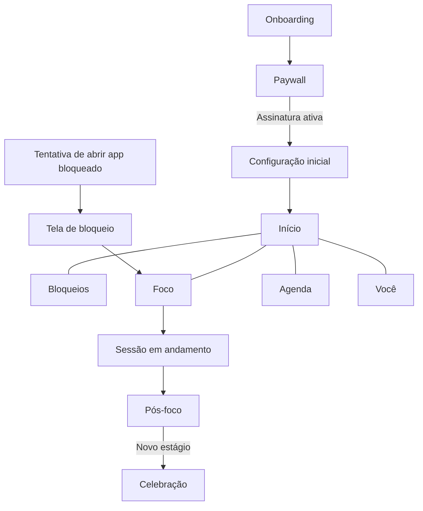

# Brotto — documentação funcional do produto

## 1. Visão geral

O Brotto é um aplicativo mobile de foco digital e bloqueio de distrações voltado ao público brasileiro. Ele reúne bloqueio de aplicativos e sites, sessões de foco, agendamentos automáticos e acompanhamento de consistência em uma experiência guiada por uma planta virtual, também chamada Brotto.

A proposta central é ajudar a pessoa a recuperar tempo e atenção sem culpa. O produto evita mensagens sobre tempo “perdido” e enfatiza o que foi recuperado, construído ou conquistado.

O download é gratuito, mas as funções práticas dependem de assinatura. O paywall aparece ao final do onboarding, depois que a pessoa entende seu impacto potencial, conhece o Brotto e passa pela solicitação de permissões.

### Público principal

- Pessoas brasileiras, principalmente entre 16 e 35 anos.
- Usuários que sentem dificuldade em controlar redes sociais, vídeos curtos e outros aplicativos de distração.
- Pessoas que querem estudar, trabalhar, dormir melhor ou recuperar tempo livre.

### Promessa do produto

> Menos scroll. Mais você.

O Brotto transforma foco e consistência em algo visível: a planta cresce conforme a pessoa cumpre sua meta diária.

## 2. Princípios da experiência

1. **Acolher sem culpar.** O aplicativo ajuda a recomeçar e não pune recaídas com linguagem negativa.
2. **Mostrar ganhos.** A métrica principal é o tempo protegido em sessões de foco concluídas.
3. **Reduzir decisões repetidas.** Uma lista central de distrações alimenta bloqueios, sessões de foco e agendamentos.
4. **Permitir ação rápida.** O bloqueio geral pode ser ativado com um toque.
5. **Criar uma pausa consciente.** O desbloqueio excepcional existe, mas inclui um momento de confirmação.
6. **Preservar a privacidade.** Dados de uso e regras de bloqueio são processados no aparelho.
7. **Gamificar sem complicar.** Não há moedas, pontos, loja ou inventário. A progressão usa streak, tempo protegido e marcos da planta.

## 3. Estrutura do aplicativo

Depois do onboarding, a navegação principal possui cinco abas:

| Aba           | Função                                                                                     |
| ------------- | ------------------------------------------------------------------------------------------ |
| **Início**    | Resume o dia, mostra o Brotto, o streak, o tempo protegido e atalhos para foco e bloqueio. |
| **Bloqueios** | Gerencia a lista central de aplicativos e sites e o estado geral do bloqueio.              |
| **Foco**      | Configura e executa sessões de Foco livre ou Pomodoro.                                     |
| **Agenda**    | Cria e pausa regras recorrentes de bloqueio.                                               |
| **Você**      | Exibe crescimento, estatísticas, preferências, permissões e assinatura.                    |

O botão de Foco ocupa a posição central e recebe maior destaque visual. Telas de bloqueio, conclusão, celebração e streak quebrado aparecem como fluxos de tela cheia fora da navegação principal.

## 4. Início

A Home concentra as informações necessárias para decidir a próxima ação.

### Conteúdo principal

- Saudação de acordo com o horário, sem nome: “Bom dia”, “Boa tarde” ou “Boa noite”.
- Brotto no estágio e humor atuais.
- Streak atual em dias.
- Tempo total protegido.
- Barra de água com o progresso da meta única de 25 minutos do dia.
- Atalho para iniciar uma sessão de foco.
- Botão para ativar ou pausar o bloqueio geral.

### Estados importantes

- **Primeiro dia:** números zerados e convite para dar o primeiro passo.
- **Dia em andamento:** progresso parcial da meta.
- **Meta cumprida:** planta regada, barra completa e reforço positivo.
- **Streak quebrado:** planta murcha e convite para recomeçar.
- **Carregamento:** skeleton enquanto os dados locais são consolidados.
- **Permissão ausente ou revogada:** aviso com acesso direto ao ajuste necessário.

## 5. Bloqueio de aplicativos e sites

É a função central do Brotto. A pessoa mantém uma única lista de distrações, compartilhada com o bloqueio manual, o Modo Foco e os Agendamentos.

### Lista central

- Inclui aplicativos instalados e domínios adicionados manualmente.
- Cada item possui controle individual.
- Um controle geral ativa ou pausa todas as regras manuais.
- A tela permite pesquisar e filtrar por categoria.
- A lista pode apresentar quais itens estão sendo bloqueados naquele momento.
- Um aplicativo desinstalado sai da lista sem apagar os totais históricos agregados.

### Ativação

Na Home ou na aba Bloqueios, a pessoa toca em **Bloquear agora**. O estado muda para **Bloqueio ativo · Desativar** e o Brotto passa a ficar “de guarda”.

### Tela exibida ao abrir uma distração

Quando um item bloqueado é aberto, o sistema substitui ou cobre seu conteúdo com a tela do Brotto:

- Brotto no humor “de guarda”.
- Título: **“A gente combinou, né? 🌿”**
- Mensagem: **“Essa distração pode esperar.”**
- Tempo restante da sessão ou horário final do agendamento.
- Lembrete do progresso em jogo, como **“Se continuar, seu Brotto chega a 7 dias.”**
- Ação principal: **Voltar pro foco**.
- Ação secundária e discreta: **Liberar por hoje**.

### Liberar por hoje

Ao escolher essa opção, o aplicativo abre a confirmação **“Respira um segundo”**. A pessoa pode voltar ao foco ou confirmar a liberação.

Regras pretendidas:

- Libera somente o aplicativo escolhido por meio de uma exceção global, válida para bloqueio manual, Foco e Agenda.
- A liberação vale até meia-noite no fuso do aparelho.
- Não zera o streak.
- Invalida apenas o critério de “cumprir os agendamentos sem liberar” naquele dia; a pessoa ainda pode regar ao acumular 25 minutos de foco.
- Depois da confirmação, o app mostra **“TikTok liberado até meia-noite.”**, substituindo o nome conforme o aplicativo escolhido.
- Depois de tentativas repetidas, o link fica visualmente mais discreto.

### Plataformas

- **iOS:** Screen Time, Family Controls, Managed Settings, Shield Configuration e Device Activity. A tela é um `ShieldConfiguration`, com personalização limitada a ícone, título, subtítulo, cores e até dois botões. O Brotto aparece como imagem estática; o botão primário é **Voltar pro foco** e o secundário é **Liberar por hoje**. O botão secundário abre o Brotto por meio de uma notificação e a confirmação acontece dentro do aplicativo.
- **Android:** Acesso de uso para detectar o aplicativo em primeiro plano e Acessibilidade para interceptar a abertura e apresentar o bloqueio.
- Todo o processamento de uso deve acontecer localmente.

O layout completo da tela de bloqueio demonstrado no protótipo aplica-se apenas ao Android. Antes do lançamento no iOS, deve ser validado se a exceção até meia-noite funciona de maneira confiável. Caso não funcione, o iOS oferecerá uma liberação de 15 minutos com texto próprio.

## 6. Modo Foco

O Modo Foco bloqueia as distrações selecionadas durante um período combinado.

### Foco livre

- Duração padrão: 45 minutos.
- Faixa prevista no protótipo: 15 a 240 minutos, em passos de 15.
- A pessoa escolhe quais itens da lista central entram na sessão.

### Pomodoro

- Padrão: 25 minutos de foco, 5 minutos de pausa e 4 ciclos.
- Foco ajustável entre 5 e 90 minutos.
- Pausa ajustável entre 1 e 30 minutos.
- Quantidade ajustável entre 1 e 8 ciclos.

### Antes de iniciar

- O app apresenta o modo, a duração e os aplicativos incluídos.
- Os itens da lista central já aparecem pré-selecionados.
- A pessoa pode editar a seleção apenas para aquela sessão.
- Durante a ativação do bloqueio, o botão apresenta um estado de carregamento.

### Sessão em andamento

- Timer circular em destaque.
- Número do ciclo e fase atual quando estiver em Pomodoro.
- Brotto concentrado durante o foco e descansando durante a pausa.
- Mensagem: **“Foco total. A distração pode esperar.”**
- Ações: pausar/continuar, acrescentar 5 minutos e encerrar.

Adicionar 5 minutos deve atualizar tanto o tempo restante quanto o total usado para calcular o anel de progresso.

Uma sessão pode permanecer pausada por até 30 minutos. Ao atingir esse limite, o aplicativo pergunta se a pessoa deseja continuar ou encerrar. O cálculo do tempo usa um relógio monotônico para não depender de alterações no relógio civil do aparelho.

### Encerramento antecipado

Ao tocar em **Encerrar**, o app pergunta **“Tem certeza? Seu Brotto vai ficar triste”**. A ação principal é **Continuar focado**; encerrar permanece possível como escolha secundária.

### Pausa do Pomodoro

Ao terminar uma fase de foco, os aplicativos permanecem bloqueados e a interface muda para **“Pausa de 5 min. Respira 🌿”**. Depois da pausa, o próximo ciclo começa e o contador avança. Antes de iniciar o Pomodoro, o aplicativo avisa: **“As distrações continuam bloqueadas nas pausas pra ficar mais fácil voltar.”**

### Conclusão

A tela de pós-foco apresenta:

- Brotto sendo regado.
- Mensagem **“Foco concluído! +N min pra você.”**
- Tempo protegido no dia.
- Ações para iniciar outra sessão ou ver o crescimento.

Se a sessão fizer o total diário chegar a 25 minutos, o dia é marcado como regado. Se também atingir um novo estágio, a celebração abre em seguida. Sessões encerradas antecipadamente contam apenas os minutos efetivamente concluídos e precisam ter pelo menos 5 minutos para entrar nas estatísticas.

## 7. Agendamentos

Agendamentos ativam bloqueios recorrentes sem depender de uma ação manual.

### Dados de uma regra

- Nome opcional.
- Aplicativos e sites abrangidos.
- Horário inicial e final.
- Dias da semana.
- Estado ativo ou pausado.

A pessoa pode criar várias regras e pausar cada uma sem apagá-la.

Não é possível salvar um agendamento sem pelo menos um aplicativo selecionado.

### Sugestão inicial

Na criação, o app oferece uma configuração frequente: bloquear redes sociais das 8h às 18h em dias úteis. A sugestão pode ser aplicada com um toque e editada antes de salvar.

### Exemplos

- **Hora de estudar:** segunda a sexta, das 8h às 18h.
- **Dormir cedo:** todos os dias, das 23h às 7h.

Regras que atravessam a meia-noite devem ser tratadas como um período contínuo.

### Sobreposição de regras

Quando um agendamento coincide com uma sessão de foco:

- Vale a união dos itens bloqueados pelas duas regras.
- Cada origem de bloqueio conserva seu próprio horário de término.
- Encerrar uma sessão de foco não encerra um agendamento ainda vigente.
- Na tela de bloqueio, um agendamento mostra uma mensagem como **“Bloqueado até 18:00”**.

Cada intervalo é avaliado separadamente. Sobreposições não duplicam tempo nem registros. Um intervalo é considerado cumprido quando termina sem liberação de nenhum aplicativo coberto por ele. Alterações feitas em uma regra valem apenas para períodos futuros. Regras que atravessam a meia-noite são divididas entre os dois dias, e um dia sem agendamento ativo não pode ser regado por esse critério.

## 8. Streak e crescimento do Brotto

O streak conta os dias consecutivos em que a pessoa regou a planta ao cumprir a meta diária.

### Critério provisório para regar

O dia é considerado cumprido quando pelo menos uma condição ocorre:

1. A pessoa acumula pelo menos 25 minutos de foco concluído no dia, somando várias sessões quando necessário; ou
2. Passa por todos os agendamentos ativos do dia sem usar **Liberar por hoje**.

Sessões encerradas antecipadamente contribuem com seus minutos concluídos quando duram pelo menos 5 minutos. O fechamento acontece à meia-noite usando o fuso registrado no início daquele dia, evitando mudanças indevidas no streak durante viagens ou alterações de fuso.

### Estágios

| Estágio        | Condição                               |
| -------------- | -------------------------------------- |
| Semente        | Início, antes do primeiro dia cumprido |
| Muda           | 1 a 6 dias                             |
| Planta jovem   | A partir de 7 dias                     |
| Planta cheia   | A partir de 30 dias                    |
| Florida        | A partir de 60 dias                    |
| Pequena árvore | A partir de 100 dias                   |

### Celebrações

Ao atingir 7, 30, 60 ou 100 dias, o app apresenta uma celebração curta com:

- Transição visual de crescimento.
- Confete e vibração.
- Mensagem específica do estágio.
- Opção para compartilhar um card quadrado com a ilustração do estágio, **“Meu Brotto chegou a X dias”**, o nome do marco e a marca discreta do produto.

O card não inclui aplicativos, horários, tentativas de abertura nem estatísticas pessoais.

Se o aplicativo estiver fechado, uma notificação leva diretamente à celebração.

### Quebra do streak

Quando a meta do dia não é cumprida:

- A sequência atual volta a zero.
- A maior sequência permanece registrada.
- O estágio máximo já alcançado não regride.
- A planta não morre; fica murcha, com folhas caídas e acinzentadas.
- A mensagem é **“Todo mundo tem dia difícil. O que importa é voltar.”**

Ao cumprir a meta novamente, o Brotto é regado e recupera sua aparência saudável.

## 9. Tempo protegido e estatísticas

Tempo protegido é a métrica principal da experiência. No MVP, ele corresponde somente aos minutos concluídos em sessões de foco. Agendamentos e tentativas de abrir aplicativos não geram minutos, e períodos simultâneos nunca são somados duas vezes.

### Visões de período

- Semana.
- Mês.
- Desde o início.

### Indicadores

- Tempo protegido.
- Sequência atual.
- Maior sequência.
- Sessões concluídas.
- Horas de foco.
- Dias regados.
- Média diária.

Os gráficos usam verde e elementos de folhas. Não há vermelho nem visualização de “dias perdidos”. Dias sem meta são mostrados de forma neutra, como folhas vazias.

Uma comparação com a média histórica de uso pode ser estudada depois do MVP. Até lá, o produto não apresenta estimativas contrafactuais nem a seção “por aplicativo”.

## 10. Onboarding e conversão

O onboarding é linear e não oferece pulo geral. A pessoa pode voltar durante o quiz.

### Sequência

1. **Splash:** Brotto nascendo, logo e frase “Seu foco. Seu tempo. Sua planta.”
2. **Boas-vindas:** proposta “Menos scroll. Mais você.”
3. **Quiz:** cinco perguntas.
4. **Calculando:** transição curta enquanto o impacto é preparado.
5. **Impacto:** estimativa positiva de dias recuperáveis por ano.
6. **Conheça seu Brotto:** apresentação dos estágios da planta.
7. **Prova social:** avaliações e depoimentos reais.
8. **Permissões:** explicação e solicitação dos acessos da plataforma.
9. **Paywall:** escolha do plano e possível trial.
10. **Configuração pós-compra:** escolha inicial de distrações e ativação do primeiro bloqueio.

### Quiz

| Pergunta                     | Tipo                        | Uso                                                                         |
| ---------------------------- | --------------------------- | --------------------------------------------------------------------------- |
| Tempo diário no celular      | Escolha única               | Calcula o impacto anual estimado.                                           |
| Aplicativos que mais prendem | Escolha múltipla e opcional | Pré-seleciona a lista inicial de bloqueios.                                 |
| Objetivo principal           | Escolha única               | Personaliza a mensagem de impacto.                                          |
| Período de maior distração   | Escolha única               | Pode orientar sugestões de agenda.                                          |
| Quanto tempo deseja proteger | Escolha única               | Personaliza a mensagem de motivação, sem alterar a meta fixa de 25 minutos. |

### Permissões

- **iOS:** explicar o acesso ao Tempo de Uso.
- **Android:** conduzir separadamente Acesso de uso e Acessibilidade.
- Mostrar que os dados permanecem no aparelho.
- Permitir seguir após uma recusa e ativar o acesso mais tarde.
- Quando uma permissão for revogada, sinalizar o problema nas áreas afetadas e oferecer correção direta.
- Suspender somente as funções que dependem da permissão revogada; as demais áreas continuam funcionando.

### Paywall

| Plano   | Preço apresentado | Observação                                                                 |
| ------- | ----------------: | -------------------------------------------------------------------------- |
| Semanal |           R$ 9,90 | Sem trial definido                                                         |
| Mensal  |          R$ 19,90 | Sem trial definido                                                         |
| Anual   |          R$ 99,90 | Aproximadamente R$ 8,32/mês, pré-selecionado e marcado como “MELHOR PREÇO” |

- Trial de 3 dias disponível somente no plano anual e somente quando a loja confirmar a elegibilidade.
- Não existe toggle manual de trial.
- A oferta informa a data e o valor da primeira cobrança.
- App Store e Google Play são as fontes de verdade para preço localizado, elegibilidade e renovação.
- Pagamento pela App Store ou Google Play.
- Cancelamento a qualquer momento.
- Opção para restaurar compras.
- Erros de compra devem manter a seleção e permitir nova tentativa.
- Fechar o paywall pode levar a uma experiência limitada, mas qualquer tentativa de usar uma função prática deve reabrir o paywall.

### Configuração pós-compra

A tela **“Seu Brotto nasceu! 🌱”** apresenta os aplicativos escolhidos no quiz já marcados. Se nenhum tiver sido escolhido, TikTok e Instagram podem servir como seleção inicial. Ao tocar em **Bloquear e começar**, o primeiro bloqueio é ativado e a Home é aberta.

## 11. Aba Você e configurações

A aba possui duas áreas: crescimento e configurações.

### Crescimento

- Estado atual do Brotto.
- Streak atual e maior streak.
- Filtros de período.
- Indicadores e gráficos de tempo protegido.
- Estado vazio para pessoas sem atividade registrada.

### Configurações

- Situação das permissões.
- Horário do lembrete diário.
- Avisos de marcos.
- Avisos de streak quebrado.
- Aparência clara ou escura aplicada ao aplicativo inteiro.
- Plano, validade e gerenciamento da assinatura.
- Troca de plano e restauração de compra.
- Termos, privacidade, suporte e informações sobre o produto.

Quando a assinatura estiver inativa, o app mostra **“Volte a cuidar do seu Brotto”** e direciona ao paywall.

O MVP não possui login nem seção Conta.

## 12. Notificações

| Gatilho                              | Mensagem                                          | Destino                     |
| ------------------------------------ | ------------------------------------------------- | --------------------------- |
| Lembrete diário no horário escolhido | “Seu Brotto tá com sede. Bora focar 25 min hoje?” | Configuração do Foco        |
| Primeiro dia após quebra do streak   | “Todo mundo tem dia difícil. Bora regar hoje?”    | Home com convite para focar |
| Novo estágio com o app fechado       | “Seu Brotto floresceu! 🌸 Vem ver.”               | Celebração do marco         |

O lembrete diário depende do horário escolhido e é cancelado assim que a meta do dia é cumprida. O aviso de streak quebrado não pode ser enviado enquanto o fechamento do dia ainda estiver sendo processado. Avisos de marco permanecem ativos conforme a preferência da pessoa. Todas as notificações respeitam o modo silencioso do sistema e o fuso do aparelho.

## 13. Assinatura e controle de acesso

- A instalação e o onboarding são gratuitos.
- As funções de bloqueio, foco, agenda e estatísticas completas exigem assinatura ativa.
- O estado da compra vem da App Store ou do Google Play e pode ter cache local.
- A restauração precisa tratar sucesso, ausência de compra e erro de rede.
- O aplicativo deve reagir a expiração, cancelamento, reembolso e período de tolerância das lojas.
- Se a assinatura expirar durante uma sessão, a sessão termina normalmente. Novas ações pagas ficam bloqueadas depois da conclusão.
- Sem assinatura, permanecem disponíveis a Home demonstrativa, a visualização dos recursos, Configurações, Permissões, Termos, Privacidade e gerenciamento ou restauração de compras.
- Tentar bloquear, iniciar foco, criar agendamento ou abrir as estatísticas completas reabre o paywall com uma mensagem relacionada à ação escolhida.

## 14. Privacidade e funcionamento local

- A lista de aplicativos e sites, os registros diários e as preferências ficam no aparelho sempre que possível.
- O MVP não exige login. A assinatura é restaurada pela loja e as preferências usam o mecanismo de backup do sistema quando disponível.
- O uso de aplicativos não deve sair do dispositivo.
- O sistema operacional deve ser consultado para saber o estado real das permissões; um valor antigo salvo localmente não é suficiente.
- Analytics de produto devem registrar o funil e eventos do Brotto sem incluir histórico detalhado de uso, nomes de aplicativos sensíveis ou conteúdo acessado.

## 15. Tom de voz

O texto é jovem, brasileiro, curto e acolhedor. Expressões como “bora”, “tá” e “pra” são adequadas quando naturais. Metáforas de planta ajudam a manter coerência, sem aparecer em todas as frases.

### Fazer

- “+25 min pra você.”
- “Todo mundo tem dia difícil. O que importa é voltar.”
- “A distração pode esperar.”
- “Seu Brotto tá com sede.”

### Evitar

- “Você perdeu 6 horas.”
- “Você falhou hoje.”
- Ameaças de perder a planta.
- Vermelho e linguagem de erro para representar dias sem meta.
- Pressão artificial ou culpa no paywall.

## 16. Estados e exceções essenciais

| Área       | Estados que precisam existir                                                                                         |
| ---------- | -------------------------------------------------------------------------------------------------------------------- |
| Home       | Primeiro dia, progresso parcial, meta cumprida, streak quebrado, carregamento e permissão revogada                   |
| Bloqueios  | Lista vazia, busca sem resultado, bloqueio ativo/pausado, item ativo/inativo e erro ao salvar                        |
| Foco       | Configuração, ativação, em andamento, pausado, pausa Pomodoro, conclusão, encerramento antecipado e erro de bloqueio |
| Agenda     | Lista vazia, regra ativa/pausada, criação, edição, regra durante a madrugada e erro ao salvar                        |
| Permissões | Não solicitado, concedido, negado, parcial no Android e revogado                                                     |
| Paywall    | Seleção de plano, elegibilidade para trial, processamento, sucesso, erro e restauração                               |
| Você       | Com dados, sem dados, assinatura ativa, assinatura inativa e permissão pendente                                      |

## 17. Diferenças conhecidas entre protótipo e comportamento pretendido

O protótipo demonstra a experiência, mas vários dados e comportamentos ainda são simulados.

- Saudação, streak, estatísticas e progresso diário usam valores fixos em algumas telas.
- A seleção feita no quiz ainda não alimenta a configuração pós-compra.
- Busca, categorias e bloqueio de sites aparecem, mas não estão completos.
- O Foco livre compartilha indevidamente valores com o Pomodoro.
- Adicionar 5 minutos pode fazer o anel ultrapassar 100%.
- A pausa e o avanço de ciclos do Pomodoro não estão completos.
- O timer visual não representa corretamente a passagem do app para segundo plano.
- Os dados escolhidos ao criar um agendamento ainda não são respeitados integralmente.
- Concluir uma sessão ainda não atualiza de forma real o streak e as estatísticas.
- O paywall fechado libera áreas que deveriam permanecer limitadas.
- Filtros de período e tema escuro são apenas parciais.
- Ícones de aplicativos e ilustrações finais do Brotto ainda são placeholders.
- Prova social, Termos, Privacidade, Suporte e Sobre dependem de conteúdo real.

Essas limitações não devem ser copiadas para o produto final.

## 18. Decisões aprovadas para o MVP

1. A métrica chama-se **tempo protegido** e conta somente minutos concluídos em sessões de foco.
2. A meta diária é única e fixa em 25 minutos. A barra de água da Home enche até esse valor; a antiga meta de 2 horas deve ser removida.
3. Várias sessões somam para regar o dia. Sessões encerradas antecipadamente contam quando atingem pelo menos 5 minutos.
4. Cumprir todos os agendamentos ativos sem liberar aplicativos também rega o dia.
5. **Liberar por hoje** cria uma exceção global para um aplicativo até meia-noite, abrangendo bloqueio manual, Foco e Agenda. As origens continuam registradas separadamente.
6. A liberação não zera o streak; invalida somente o critério de cumprimento dos agendamentos naquele dia.
7. O trial tem 3 dias, existe apenas no anual e depende da elegibilidade informada pela loja. Não há toggle manual.
8. O Pomodoro mantém as distrações bloqueadas durante as pausas.
9. A pausa manual tem limite de 30 minutos.
10. O MVP não possui login, nome na saudação nem seção Conta.
11. O card compartilhável é quadrado e contém somente ilustração do estágio, “Meu Brotto chegou a X dias”, nome do marco e marca discreta.
12. A meta personalizável e comparações com média histórica ficam para versões posteriores.

### Validação técnica pendente

A exceção global até meia-noite precisa ser validada no `ShieldConfiguration` do iOS antes de ser comunicada. Se a plataforma não permitir esse comportamento com confiabilidade, o iOS usará uma liberação de 15 minutos com texto próprio. O Android mantém o fluxo completo apresentado no protótipo.

## 19. Critérios gerais de aceite

O produto está funcionalmente coerente quando:

- A mesma lista central alimenta bloqueio manual, Foco e Agenda.
- Regras simultâneas formam a união dos itens bloqueados sem encerrar umas às outras.
- O timer sobrevive ao aplicativo em segundo plano e a reinicializações razoáveis do processo.
- A virada do dia usa o fuso registrado no início do dia e não duplica nem perde registros.
- O estágio máximo nunca regride quando o streak quebra.
- Uma liberação excepcional afeta somente o item e o período definidos.
- Tempo protegido e estatísticas são derivados de sessões reais, sem estimativas no MVP.
- Permissões revogadas são detectadas e explicadas no ponto em que afetam uma ação.
- Sem assinatura ativa, nenhuma função prática é liberada por engano.
- Todos os erros permitem recuperação sem apagar escolhas já feitas.
- A linguagem continua acolhedora nos estados de erro, recusa, interrupção e streak quebrado.
- Uma permissão revogada suspende somente as funções afetadas e apresenta instruções para reativação.
- Um aplicativo desinstalado sai da lista de bloqueio sem apagar seu histórico agregado.
- O card de compartilhamento nunca expõe aplicativos, horários, tentativas de abertura ou estatísticas pessoais.

## 20. Fontes desta documentação

- Especificação funcional fornecida para o Brotto.
- Projeto Figma Make `8TBAmKMgwqfV2x8R9fPeNg`, chamado atualmente “Enviar documentos para revisão”.
- Mapa local do protótipo em `brotto-fluxo.html`, produzido a partir dos arquivos do protótipo e de sua especificação de origem.

O nome do projeto no Figma deve ser atualizado para algo como **“Brotto — protótipo mobile”**, evitando confusão para futuras pessoas do time.
